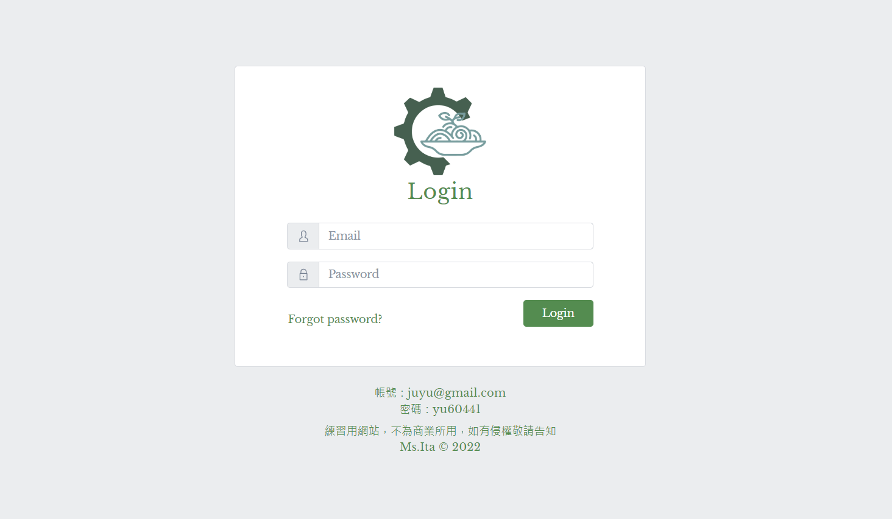
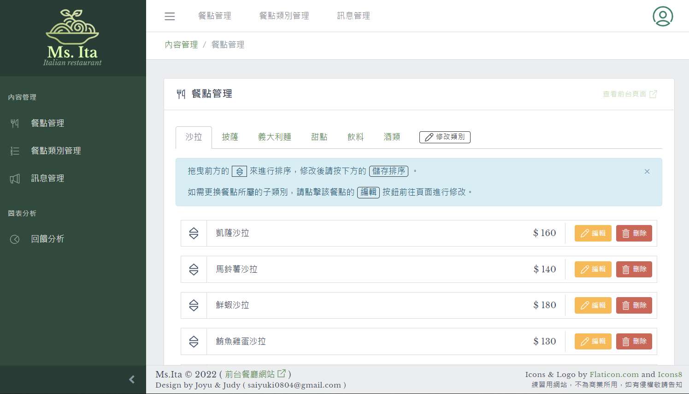
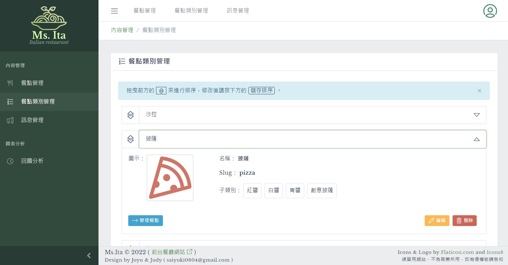
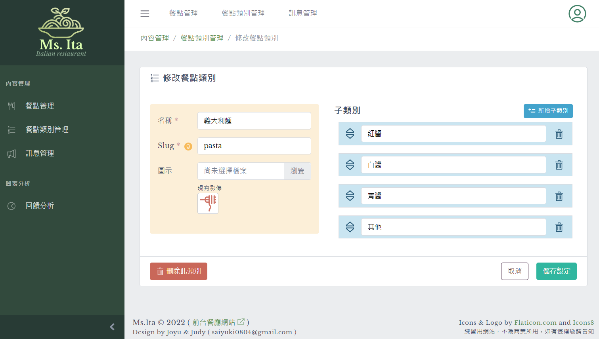
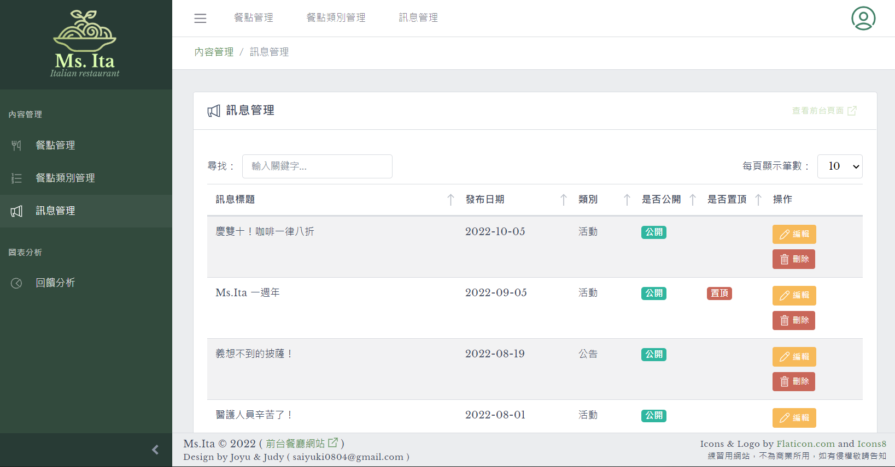
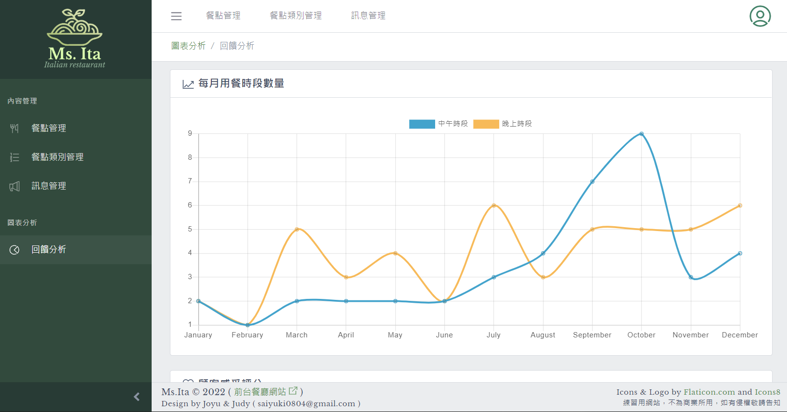

# Ita.bkstg


義式餐廳網站，以 前後端分離模式開發，前端包含前台網站與後台管理系統。

此為 **後台管理系統**。

- Demo
  - 後台管理系統 Ita.bkstg：[Demo](http://ita.bkstg.surge.sh/login)
  - 前台網站 Ms.Ita：[Demo](http://msita.surge.sh/home)
 
- Github
  - 前台 [Github](https://github.com/JudyTsai23/Ms.Ita)
  - 後端 Server [Github](https://github.com/JudyTsai23/Ita.server)

## 🍝 About Ita.bkstg

### Screenshots
| 登入 | 餐點管理 |
|--------------|-------------|
|  |  |

| 餐點類別管理 | 修改餐點類別 |
|--------------|-------------|
|  |  |  

| 訊息管理 | 回饋分析 |
|--------------|-------------|
|  |  |  


包含：
- **登入**

  簡易登入功能，帳號密碼在畫面下方。
  
- **餐點管理**

  管理餐點基本資訊、餐點類別、是否為限定餐點、是否公開等，並且可用拖拉的方式排序餐點順序。

- **餐點類別管理**

  管理餐點類別的基本資訊，可修改餐點類別的名稱及 slug，並可增刪子類別。

- **訊息管理**
  
  管理訊息基本資訊，包含標題、類型、發布日期、是否公開、是否置頂等。
  
- **回饋分析**

  依據顧客填寫的意見回饋表單，分別做 每月意見回饋數量、每月用餐時段數量 及 顧客感受評分 之圖表分析。
  
(為避免測試資料遭刪除，網頁有擋部分資料的刪除功能！)


## 🛠 CoreUI Admin Template

- API : [Ver. 3.2 Document](https://coreui.io/vue/docs/3.2/components/button-components.html)
- Style API : [Customize color Docment](https://coreui.io/docs/customize/color/)

## ⚙ Development

### Setup
```
npm install
```

### Compiles and hot-reloads for development
```
npm run serve
```

### Compiles and minifies for production
```
npm run build
```
